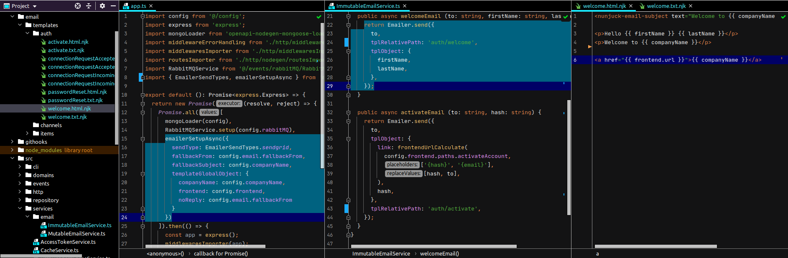

# nunjucks-emailer

Write email templates with Nunjucks in independent html and text files, send with SendGrid or log to console &/or disk or simply return the email object for other use.

Automatically pickout html and text file based on a the fie structure, see below.

> New providers are welcomed, please create a pull request. This was built for use with sendgrid and unit testing domain methods.
> Additionally, language ability will be coming at some point, unless someone gets a pr in there 1st :) Someting like welcome.en.html.njk

## How it works
The email template files are kept in a separate folder to the rest of the source code of your app. Your app uses this package, this package loads templates based on the provided templatePath at setup.

You should write html AND txt versions of each email you want to send, your folder structure might look like this:



You should setup the emailer package with an [EmailerConstructor](https://github.com/johndcarmichael/nunjucks-emailer/blob/master/src/interfaces/EmailerContructor.ts) object which will also `fs.ensureDir[Sync]` the log directory:
  - `emailerSetupSync(options)`
  - `emailerSetupAsync(options)`

Lastly, call the [Emailer send method](https://github.com/johndcarmichael/nunjucks-emailer/blob/master/src/Emailer.ts#L9), see below.

## Setup options explained and default values
```typescript
export enum EmailerSendTypes {
  sendgrid = 'SENDGRID', // will only send to sendgrid
  file = 'FILE', // will only write to disk in the logPath directory provided in the setup options
  log = 'LOG', // will console.log and log to disk in the logPath directory provided in the setup options
  return = 'RETURN', // will only return the object that would have otherwise been used in the above
}

export default interface EmailerConstructor {
  templatePath?: string; // Full path to the folder containing the nunuck email templates, defaults to ./email/templates
  sendType: EmailerSendTypes; // This dictates what happens when Emailer.send is called values from the above enum
  logPath?: string; // Dictates where the emails are written to disk: EmailerSendTypes.file, defaults to email/logs
  fallbackFrom: string; // The from email used when no from email provided, typically a system email address, eg "no-reply@myawesome.app"
  fallbackSubject: string; // If not subject is provided or found this is the fallback
}
```

## Example setup and use
Setup the emailer in the entry file eg: [app.ts](https://github.com/acrontum/nunjucks-typescript-server/blob/master/src/app.ts):
```typescript
import { emailerSetupSync, EmailerSendTypes } from 'nunjucks-emailer';

emailerSetupSync({ 
  sendType: EmailerSendTypes.sendgrid,
  fallbackFrom: 'no-reply@myapp.com',
});
```

Use the emailer in another file in your app now without having to call setup each time, eg in a [domain method](https://github.com/acrontum/nunjucks-typescript-server/blob/master/src/domains/___stub.ts.njk):
```typescript
class RegisterDomain {
  public async registerEmailPost (body: RegisterEmailPost, req: any): Promise<Login> {
    // register user ...

    // send out email
    await Emailer.send({
      to: 'john@john.com',
      from: 'bob@bob.com', 
      subject: 'Welcome to the app John!', 
      tplObject: {name: 'John'}, 
      tplRelativePath: 'welcome'
    })

    // return 
  }
}
```

The default path for the templates relative to the base of the server:
```typescript
path.join(process.cwd(), 'email/templates')
```

## Email Subject
As mentioned above you have the subject fallback should one not be provided to `Emailer.send`, but the subject can also be written into the email HTML template:
```
<p>Welcome {{ name }}</p>
<p>{{ globalNumber }}</p>
<nunjuck-email-subject text="{{name}} welcome to this app"></nunjuck-email-subject>
```

Then used like this:
```
await Emailer.send({
  to: 'john@john.com',
  from: 'bob@bob.com', 
  tplObject: {name: 'John'}, 
  tplRelativePath: 'welcome'
})
```

This allows for encapsulating all copy content in the template - instead of some in the typescript code and some in the template code.

With no subject in the `Emailer.send` params, and no subject tag in the HTML template.. then the tool will use the fallback. 


## Global variables (common dynamic content)
To inject say, a company telephone number into an email, you would likely want to grab this from a managed source instead of changing hardcoded emails all the time, or injecting the common content to every email tplObject.. gets fairly repetitive quite quickly.

Add to the setup:
```typescript
import { Emailer, emailerSetupSync, EmailerSendTypes } from 'nunjucks-emailer';

emailerSetupSync({
  sendType: EmailerSendTypes.file,
  fallbackFrom: 'no-reply@myapp.com',
  templateGlobalObject: {
    contactUsEmail: 'hello@myapp.com',
    telephoneNumber: '0123654789',
  }
});
```

Now you do not have to worry about injecting this content into email tplObject sent to Emailer.send or hardcoding it into email templates. Just call it:
```twig
Hi,

You can reach us at {{ contactUsEmail }} or call us on {{ telephoneNumber }}
```

The global object is also logged and returned from the dens function.


## Unit test example

Check the source code of this package: [src/__tests__/Emailer.spec.ts](https://github.com/johndcarmichael/nunjucks-emailer/blob/master/src/__tests__/Emailer.ts)

As it is possible to return the prepared object from this tool it makes it possible to unit test a domain method very easily, just run the setup and instruct to write to file, log or return the object, eg:

```typescript
emailerSetupSync({ sendType: EmailerSendTypes.log });
```

Then continue to use the package as normal. As the typescript server has the domain layer abstracted from the http layer, you can now write the business logic in a domain method as above and then unit test without mocking or sending out actual emails.

To assist, there are 2 public helper functions in the Emailer class to fetch log files:
```typescript
// Will return a numeric array of file names
const fileNames = await Emailer.getLogFileNames();
// Will return the last email object written to disc
const fileJson = await Emailer.getLatestLogFileData();
// Will clear directory of json email logs (most helpful when writing tests the app which uses this class)
await Emailer.removeAllEmailJsonLogFiles();
```


## Setup sync & async
Depending on the design of your system, you may be ok or not ok with using a blocking form of the setup emailerSetupSync. Typically if you are only setting up at 1 point in the app this is a not a problem, but if you are dynamically changing on the fly, you should use `emailerSetupAsync`, it does the same job but asynchronously and returns a promise. See the "should initialise correctly" test in "Emailer.spec.ts" file.


